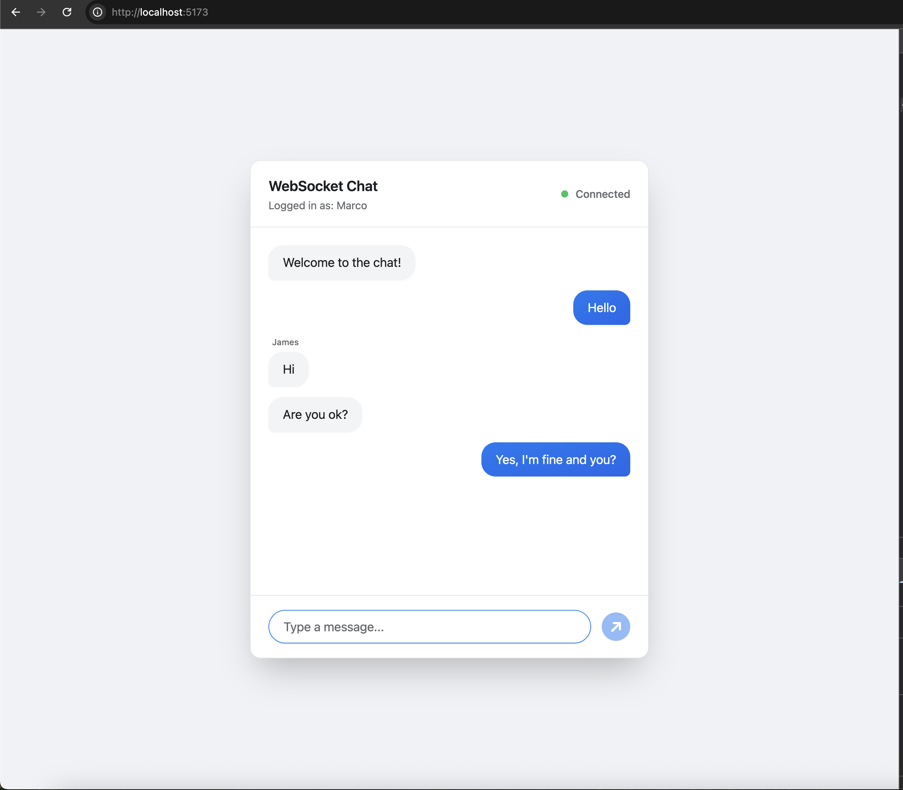

# React WebSocket Chat - Messenger Style

A real-time chat application built with React and WebSocket, styled like Facebook Messenger with full mobile responsiveness and Tailwind CSS.



## Features

- ✅ Real-time messaging with WebSocket
- ✅ Messenger-like UI design with message bubbles
- ✅ Mobile responsive (works perfectly on all screen sizes)
- ✅ User identification and message grouping
- ✅ Click-to-show timestamps on individual messages
- ✅ Connection status indicator
- ✅ Auto-reconnection on disconnect
- ✅ Touch-friendly interface
- ✅ Tailwind CSS styling with custom messenger theme

## Project Structure

```
react-websocket-chat/
├── public/
│   └── preview.png         # Preview screenshot
├── src/
│   ├── components/         # React components (Tailwind styled)
│   │   ├── ChatMessage.jsx
│   │   ├── ChatInput.jsx
│   │   └── ConnectionStatus.jsx
│   ├── hooks/              # Custom React hooks
│   │   └── useWebSocket.js
│   ├── services/           # WebSocket service
│   │   └── websocket.js
│   ├── App.jsx
│   ├── index.css           # Tailwind CSS imports
│   └── main.jsx
├── tailwind.config.cjs     # Tailwind configuration
├── postcss.config.cjs      # PostCSS configuration
├── server.js               # WebSocket server
├── package.json
└── README.md
```

## Installation

1. Clone or navigate to the project directory:
```bash
cd react-websocket-chat
```

2. Install dependencies:
```bash
npm install
```

## Running the Application

You need to run both the WebSocket server and the React client.

### Quick Start (Real Multi-User Chat)

1. **Start the WebSocket server** (in one terminal):
```bash
node server.js
```
Server runs on `ws://localhost:8080`

2. **Start the React app** (in another terminal):
```bash
npm run dev
```
App runs on `http://localhost:5173`

3. **Test multi-user chat:**
   - Open multiple browser tabs/windows
   - Enter different usernames in each tab
   - Start chatting! Messages appear in real-time across all windows

### How to Chat with Other Users

✅ **The app is already configured for multi-user chat!**

1. Make sure both server and client are running
2. Share the URL (`http://localhost:5173`) with friends on the same network
3. Each person enters a different username
4. All messages appear in real-time for everyone
5. Your messages show on the right (blue), others on the left (gray)

## How It Works

### WebSocket Service (`src/services/websocket.js`)
- Manages WebSocket connection lifecycle
- Handles reconnection logic
- Provides publish-subscribe pattern for events
- Singleton pattern for global state management

### Custom Hook (`src/hooks/useWebSocket.js`)
- React hook that wraps the WebSocket service
- Manages connection state
- Provides easy-to-use interface for components
- Handles cleanup on unmount

### Components
- **App.jsx**: Main component with username setup and chat interface
- **ChatMessage**: Displays individual messages with timestamp
- **ChatInput**: Input field and send button for new messages
- **ConnectionStatus**: Visual indicator of WebSocket connection state

### WebSocket Server (`server.js`)
- Simple Node.js WebSocket server using the `ws` package
- Broadcasts messages to all connected clients
- Tracks number of connected users
- Handles connection/disconnection events

## WebSocket Events

The application handles these message types:

```javascript
{
  user: "username",
  text: "message content",
  timestamp: "2024-01-01T00:00:00.000Z"
}
```

## Customization

### Change WebSocket URL
Edit `src/App.jsx`:
```javascript
const WS_URL = 'ws://your-websocket-server-url';
```

### Modify Reconnection Settings
Edit `src/services/websocket.js`:
```javascript
this.reconnectInterval = 3000; // Time between reconnection attempts
this.maxReconnectAttempts = 5; // Maximum number of attempts
```

### Styling
The application uses **Tailwind CSS** for styling:
- `tailwind.config.cjs` - Tailwind configuration with custom messenger colors
- `src/index.css` - Tailwind imports and base styles
- All components use Tailwind utility classes for styling
- Custom messenger theme colors: `messenger-blue`, `messenger-gray`, etc.

## Technologies Used

- **React 18** - UI library
- **Vite** - Build tool and dev server
- **Tailwind CSS v3** - Utility-first CSS framework
- **WebSocket API** - Real-time communication
- **ws** - WebSocket library for Node.js server

## Browser Support

Works in all modern browsers that support WebSocket:
- Chrome/Edge 88+
- Firefox 85+
- Safari 14+

## Troubleshooting

**Connection fails:**
- Ensure the WebSocket server is running
- Check the WebSocket URL is correct
- Verify firewall settings allow WebSocket connections

**Messages not appearing:**
- Check browser console for errors
- Verify WebSocket connection status indicator
- Ensure message format matches expected structure

**Auto-reconnect not working:**
- Check reconnection settings in `websocket.js`
- Verify server is accessible
- Check for any network issues

## Future Enhancements

- [ ] Add user typing indicators
- [ ] Message persistence with database
- [ ] User authentication
- [ ] Private messaging
- [ ] File sharing
- [ ] Message reactions
- [ ] Room/channel support
- [ ] Message editing and deletion

## License

MIT

## Contributing

Feel free to submit issues and enhancement requests!
